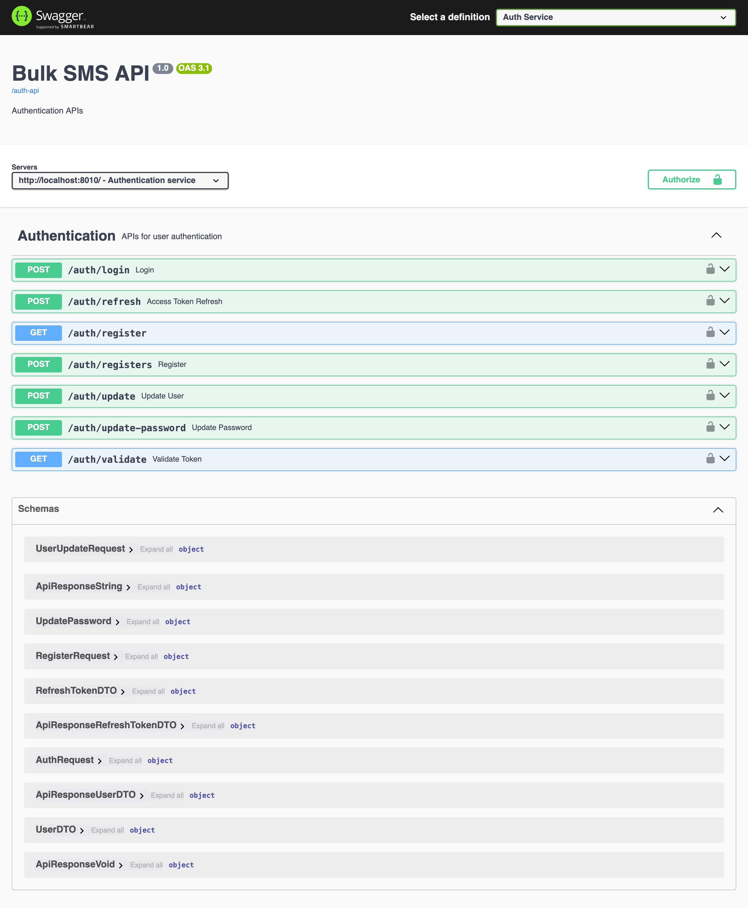
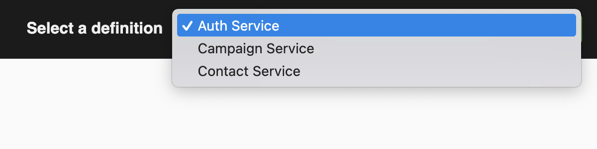

# 📡 Bulk SMS Microservices System

This repository is a **monorepo** housing the microservices that power a Bulk SMS system. The system is built with **Spring Boot**, leverages **Spring Cloud** for service discovery and gateway routing, and uses **JWT-based authentication**.

## 🧱 Microservices Overview

| Service      | Port | Description                                                |
|--------------|------|------------------------------------------------------------|
| API Gateway  | 8010 | Entry point and request routing                            |
| Auth         | 8050 | Authentication and JWT management                          |
| Contact      | 8040 | Manages contacts and groups                                |
| Campaign     | 8030 | Handles SMS campaign scheduling                            |
| Eureka Server| 8761 | Service registry for microservices location and communicate|

---

## 🚀 Technologies Used

- **Spring Boot 3.x**
- **Spring Cloud Gateway**
- **Spring Cloud Netflix Eureka**
- **Spring Security + JWT**
- **Reactive Feign Client**
- **WebClient (with LoadBalanced)**
- **Spring Cloud Sleuth + Zipkin** for distributed tracing
- **Spring Boot Admin** for monitoring
- **SpringDoc OpenAPI (Swagger UI)** for API documentation
- **Gradle** as the build tool
- **Resilience4J** Retry mechanism and circuit breaker per service

---

## 📂 Monorepo Structure

```
bulk-sms/
│
├── api-gateway/         # Gateway service (Spring Cloud Gateway)
├── auth/                # Authentication service
├── contact/             # Contact management service
├── campaign/            # Campaign management service
├── admin-server/        
├── discovery-client/    
└── README.md
```

---

## 🔐 Authentication (JWT)

- The `auth` service handles user login, registration, and issues **JWT access and refresh tokens**.
- Tokens are validated by the `auth` service via a REST call (or via **Reactive Feign**).
- The gateway filters incoming requests, validates tokens, and forwards to downstream services.

---

## 📦 Running Locally

> Prerequisites: Java 21, Gradle, Docker (for Zipkin), Eureka up and running

### Start Zipkin:
```bash
docker run -d -p 9411:9411 openzipkin/zipkin
```

### Run each service
```bash
cd api-gateway
./gradlew bootRun

cd auth
./gradlew bootRun

...
```

> Make sure Eureka is up and each service registers properly.

---

## 🧪 API Documentation

Access each service's Swagger UI (through Gateway):
- `http://localhost:8010/gateway-api-doc.html`



---

## 📝 Choose Service Api Documentation



---

## 📈 Monitoring and Tracing

- **Spring Boot Admin** for UI monitoring (Actuator endpoints)
- **Zipkin** available at: [http://localhost:9411](http://localhost:9411)

---

## 📝 To Do

- [ ] Centralized logging with ELK or Loki
- [ ] Add rate limiting with Resilience4J
- [ ] Docker Compose setup for full-stack startup

---

## 📬 Contributions

PRs are welcome. This is an educational project meant for experimenting with Spring Boot Microservices architecture.

---

## 📜 License

MIT License
